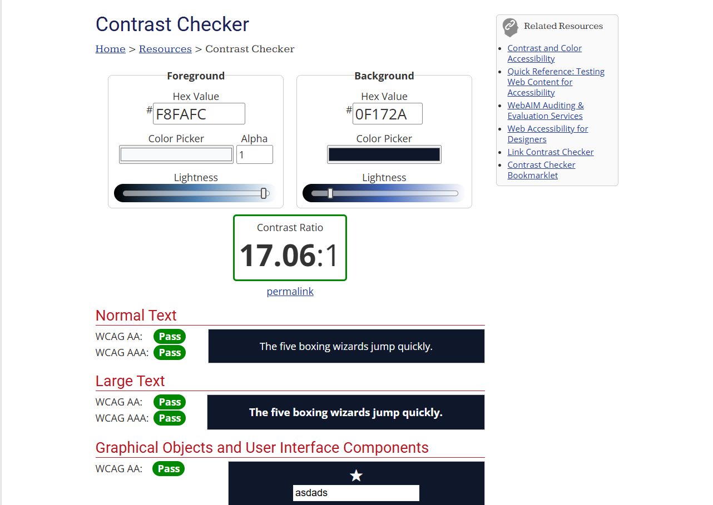
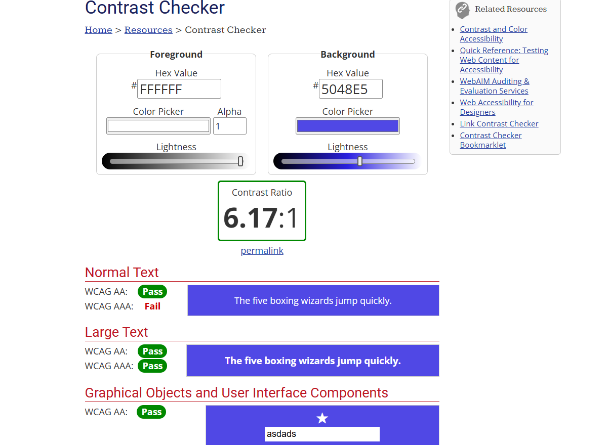

# Design System - Portfolio

## 1. Typography

    Font for H1, H2, H3: Montserrat

    Font for the body: Inter

## 2. Colour palette

### Dark Mode

    Text (Main Text): #F8FAFC
    Background (Main Background Colour): #0F172A
    Primary (Main actions): #6366F1
    Secondary (Background for cards/sections): #1E293B
    Accent (Buttons, links and hovers): #14B8A6

### Light Mode

    Text: #0f1729
    Background: #E2E8F0
    Primary: #5048e5
    Secondary: #FFFFFF
    Accent: #0d968b

## 3. Spacing guide

    Rule of 8px & set of icons from Lucide Icons / Phosphor Icons

## 4. Accessibility checks (A11y)

### Dark Mode main reading (text foreground on Background)

### Light Mode Button (text foreground on Background, only fails WCAG AAA)

## Interesting Websites that could help you too :}

### https://fonts.google.com

### https://www.realtimecolors.com

### https://webaim.org/resources/contrastchecker/